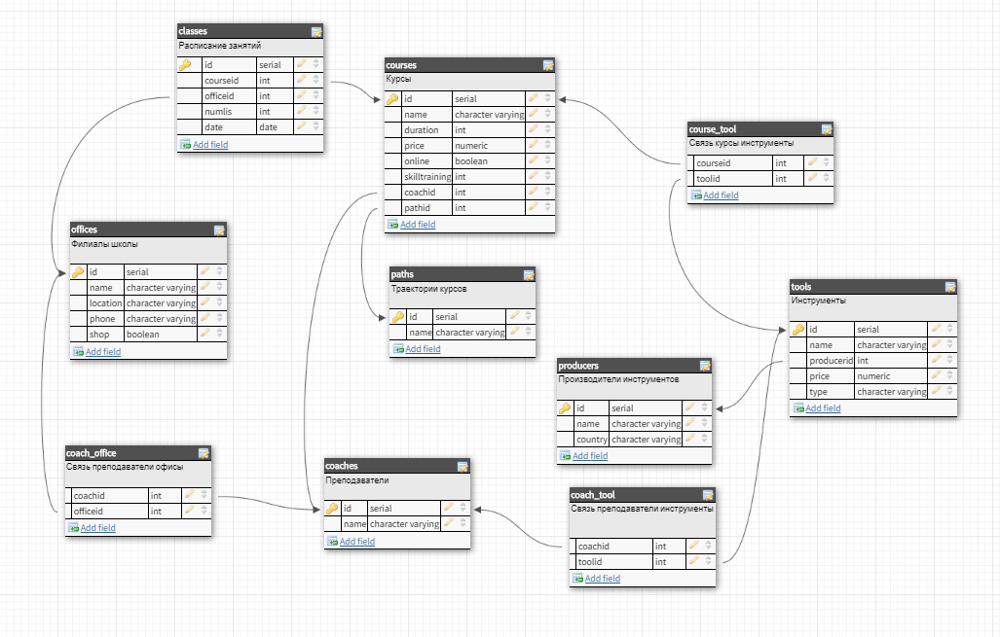

# База данных школы ногтевого сервиса
## Предметная область
Школа ногтевого сервиса, которая состоит из филиалов по городу. В школе проводятся курсы по направлениям ногтевого сервиса: маникюр, педикюр, наращивание и дизайн, каждый из курсов принадлежит к одному из направлений. Каждый курс ведет один и только один преподаватель (все курсы авторские), один преподаватель может работать в нескольких филиалах, поэтому связь преподаватели - филиалы m:m, курс может быть проведен в любом из филиалов, в котором работает преподаватель - автор данного курса. На курс нужно приносить определенный набор инструментов, которые рекомендует преподаватель курса (при этом один и тот же инструмент может фигурировать в разных наборах у разных преподавателей и на разных курсах), поэтому связь курс - инструменты m:m. Также конкретный преподаватель имеет свой набор инструментов, которыми он владеет (например, один преподаватель владеет лишь ножничками, а другой лишь щипчиками), при этом общий набор инструментов преподавателя состоит из всех инструментов, которыми он владеет и может преподавать их использование, но, естественно, на конкретный курс не нужно приносить все инструменты, которыми в принципе владеет автор курса, также один и тот же инструмент (одну и ту же модель инструмента) может использоваться разными преподавателями, связь преподаватель - инструмент m:m. Также занятия проводятся по разным курсам в разных школах в разные дни (нет определенного расписания из недели в неделю) и с разным количеством слушателей, которые определяет школа, поэтому можно узнать, когда же будет проводиться желаемый курс, сколько слушателей на нем будет.
## Описание схемы базы данных
- offices:
    - name ー краткое название, чтобы легко запомнить
    - location ー улица и дом, где находится школа
    - phone ー куда позвонить, чтобы записаться или что-то уточнить
    - shop ー у некоторых из них при школе есть магазин (t), у некоторых нет (f).
- courses:
    - name ー название курса
    - duration ー количество дней, которое идет курс
    - price ー стоимость всего обучения
    - coachid ー преподаватель, проводящий курс
    - skill training ー количество моделей для отработки,сколько суммарно будет отработок - 1 модель - 1 отработка
    - online ー в школе также есть онлайн-курсы, и к некоторым оффлайн курсам дополнительно прилагается аналогичный онлайн курс, идет ли в подарок онлайн-курс
    - pathid ー область ногтевого сервиса, на которую направлен данный курc
- coaches:
    - name ー ФИ
    - experience ー опыт преподавания всего в годах
- tools:
    - name ー полное название, которое устанавливает фирма
    - producerid ー производитель
    - price ー розничная цена в магазинах данной школы
    - type ー вид инструмента по предназначению
- producers:
    - name ー название производителя
    - country ー страна, в которой идет производство
- classes:
    - courseid ー курс, который будет идти
    - officeid ー где будет курс
    - numlis ー максимальное число людей, которые могут посетить курс

## Схема базы данных   
